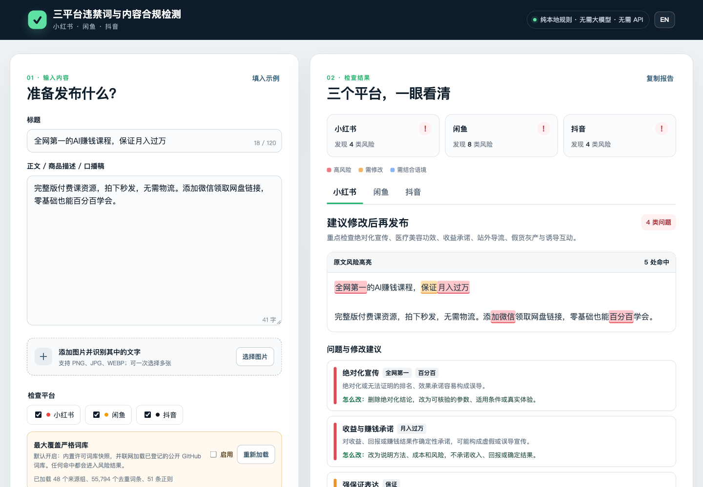

# 小红书、闲鱼、抖音违禁词与内容合规检测工具

**简体中文** | [English](README_EN.md)

一个无需大模型、无需 API Key、无需安装的网页工具，用于在发布前检查小红书、闲鱼和抖音标题、正文、商品描述、口播稿及图片文字中的常见合规风险。

## 普通用户：直接打开即可使用

**在线版：https://catink.github.io/content-compliance-checker/**

绝大多数用户不需要下载代码，也不需要自己部署。打开上面的在线版，输入标题、正文或图片后就可以检查。

在线版的标题、正文和检测过程都在当前浏览器中完成，不会把文案发送给本项目自建的服务器，也不调用大模型。页面本身、公开 GitHub 词库以及图片 OCR 组件仍需通过网络加载。

## 界面效果



## 适用语言：检测中文内容

本工具是针对小红书、闲鱼和抖音中文内容的合规自查工具，**不是英文内容审核器**。

词库中虽然存在英文字母条目，但绝大多数是网址、域名、拼音变体、平台缩写、品牌名和 `VX`、`QQ`、`token` 等中文内容中的辅助信号，不构成完整的英文平台审核词库。实际漏检测试也证明，英文医疗保证、论文代写、收益承诺和刷粉刷量文案都无法被可靠识别。

GitHub 提供英文 README 是为了让英文读者了解、审查和部署本项目，不代表检测工具支持英文文案审核。详细统计和漏检测试见 [`docs/LANGUAGE_SCOPE_AUDIT.md`](docs/LANGUAGE_SCOPE_AUDIT.md)。

## 什么情况才需要自己部署

自行部署是可选项，不是使用前提。只有以下需求才建议下载源码：

- 要在公司内网或无法访问公共网站的环境使用；
- 要固定某个版本，不随公共在线版更新；
- 要求完全断网使用，并愿意把远程词库和 OCR 资源改为本地文件；
- 要把企业内部词库永久内置，而不是每次手动导入；
- 要更换界面、品牌、域名，增加平台、批量检测或内部系统集成。

如果没有上述需求，直接使用在线版即可。GitHub 仓库主要是为需要审查源码、固定版本或二次开发的人保留。

## 特点

- 完全基于本地 JavaScript 规则运行，不调用任何大语言模型。
- 分别输出小红书、闲鱼和抖音的检查结论。
- 在原文中高亮命中的风险表达。
- 为每个问题提供原因和修改方向。
- 支持标题、正文和图片 OCR 文字一起检查。
- 不需要注册账号、配置服务器或填写 API Key。
- 纯静态网页，可部署到 GitHub Pages、Cloudflare Pages、Netlify 等平台。
- MIT License，可自由使用、修改和二次开发。
- 默认启用“最大覆盖严格词库”：打包许可允许再分发的快照，并联网加载已登记的公开 GitHub 词库。
- 支持导入自定义 TXT、CSV、TSV 扩展词库，最多读取 50,000 个去重词条。

## 下载后本地使用（可选）

### 方法一：直接打开本地文件

1. 下载本仓库并解压。
2. 打开 `dist` 文件夹。
3. 双击 `index.html`。

标题和正文检查不依赖网络。图片 OCR 组件默认从 jsDelivr 加载，因此第一次使用图片文字识别时需要联网；即使 OCR 加载失败，也可以手动把图片文字粘贴进识别框继续检查。

### 方法二：启动本地静态服务器

如果浏览器限制本地文件加载，可以在项目目录运行：

```bash
python3 -m http.server 8000 --directory dist
```

然后打开：

```text
http://localhost:8000
```

### 方法三：部署自己的副本

仓库已包含 `.github/workflows/pages.yml`，启用 GitHub Pages 的 GitHub Actions 发布源后，每次推送到 `main` 都会自动发布 `dist` 目录。

## 工作原理

工具使用确定性规则完成检查：

1. 汇总标题、正文和图片 OCR 文字。
2. 读取通用规则和各平台专属规则。
3. 对风险词、短语和部分模式进行匹配。
4. 按 `high`、`medium`、`review` 三个等级归类。
5. 记录每个命中的原文位置并渲染高亮。
6. 输出规则中预先维护的原因和修改建议。

它不是 AI 模型，不会自行推测平台内部审核算法，也不会通过谐音、拆字等方式帮助绕过审核。

## 词库覆盖与扩展

当前内置的是经过筛选、能说明原因和修改方向的默认规则，并不是平台未公开的“完整内部屏蔽词库”。内置去重词/短语数量为：

| 平台 | 默认内置词/短语 |
| --- | ---: |
| 小红书 | 147 |
| 闲鱼 | 174 |
| 抖音 | 152 |

默认开启的“最大覆盖严格词库”会同时使用两类数据：许可证允许再分发的公开词库快照随项目打包；没有明确许可证的平台词库从其原 GitHub 地址实时读取并保留来源。现在不再把所有文件粗暴当作词表：源项目使用正则、组合条件、弱匹配、分词或上下文时，本工具会按相应逻辑处理。

当前验证构建成功加载了 48 个非空来源组、55,794 个去重词条和 51 条正则；其中本地许可词库快照包含 24 个来源文件、53,045 个去重词条。审计后的运行时总数变少，是因为删除了说明文字、替代词、代码字符串、分词主词典和无语义单字，不是缩减有效规则。运行时会继续读取公开 GitHub 来源，所以仓库更新或网络状态变化时，实际数量可能不同。

除单词匹配外，工具还包含确定性的组合规则。例如“接单/承接/代做/帮做”与“毕业设计/论文/课程设计/开题报告”等同时出现时，会直接判为学术代做高风险；不依赖远程词库，也不需要大模型。

如果还需要追加自己的行业库，可以在页面的“扩展词库”区域导入 `.txt`、`.csv` 或 `.tsv` 文件。每行、逗号或制表符分隔的内容都会作为候选词条读取，最多保留 50,000 个去重词条。

扩展词库的命中统一显示为蓝色“需结合语境”，不会被工具自动判为高风险。这样可以同时满足大词库覆盖和减少误报两个目标。

由于部分 GitHub 词库没有明确的再分发许可证，本项目不把这些整库复制进 MIT 发布包，而是在浏览器运行时直接从原 GitHub Raw 地址加载。这些远程来源不可用时，工具会继续使用已经打包的许可词库快照和内置平台规则。

逐个项目的真实检测方式、适配方法和排除项见 [`docs/SOURCE_ADAPTER_AUDIT.md`](docs/SOURCE_ADAPTER_AUDIT.md)。

## 隐私

- 标题和正文只在当前浏览器内处理。
- 上传的图片不会发送到本项目自建服务器。
- 图片 OCR 由浏览器中的 Tesseract.js 执行。
- Tesseract.js 脚本和语言资源默认从公共 CDN 加载；如需要完全离线运行，可以自行下载并改成本地资源路径。
- 本项目没有统计、登录、广告或用户数据收集代码。

## 当前支持的平台

| 平台 | 重点检查方向 |
| --- | --- |
| 小红书 | 绝对化宣传、医疗美容功效、收益承诺、站外导流、跨平台引导、灰产、迷信营销、诱导互动 |
| 闲鱼 | 站外交易、虚拟资源交付、侵权资源、学术代做、账号和自动化工具、禁止交易内容 |
| 抖音 | 站外导流、危险行为、隐私、人肉搜索、低俗或违法引导、不实信息、版权搬运、AI与演绎标识 |

## 修改或增加规则

当前规则集中维护在：

```text
dist/app.js
```

规则格式：

```javascript
rule(
  "风险类别",
  "high", // high / medium / review
  ["词语一", "词语二"],
  "命中原因",
  "修改建议"
)
```

- `COMMON_RULES`：三个平台共用的规则。
- `PLATFORM_RULES.xiaohongshu`：小红书规则。
- `PLATFORM_RULES.xianyu`：闲鱼规则。
- `PLATFORM_RULES.douyin`：抖音规则。

新增规则后，打开网页使用“填入示例”或自定义测试文案检查高亮、分类和修改建议。

## 项目结构

```text
content-compliance-checker/
├── dist/
│   ├── index.html       # 页面结构
│   ├── styles.css       # 页面样式
│   ├── app.js           # 平台规则、检测引擎和交互逻辑
│   ├── lexicon-loader.js   # 公开词库来源和运行时加载器
│   └── lexicon-snapshot.js # 可再分发词库的生成快照
├── docs/
│   ├── RULE_SOURCES.md  # 规则来源和证据边界
│   ├── SOURCE_ADAPTER_AUDIT.md # 源项目用法审计与适配说明
│   ├── LANGUAGE_SCOPE_AUDIT.md # 中英文词库范围和英文漏检审计
│   └── images/          # README 真实运行效果图
├── tools/
│   └── build_lexicon_snapshot.mjs # 更新许可词库快照
├── LICENSE
├── README_EN.md    # English project documentation
└── README.md
```

## 重要边界

本工具只能发现已经写入规则库的文字风险，不能保证内容一定通过平台审核。平台还可能结合图片画面、视频动作、音轨、商品类目、经营资质、素材授权、账号状态和历史行为进行审核。

图片功能目前只识别和检查图片中的文字，不判断人物、动作、暴露程度、品牌 Logo、版权或其他视觉内容。

平台规则会持续变化。维护者和使用者应定期核对平台最新公开规则，不应把民间词库当作平台官方完整黑名单。

## 参与贡献

欢迎提交 Issue 或 Pull Request：

- 新增有明确来源的平台规则；
- 补充真实误报或漏报案例；
- 改进中文、英文和变体匹配；
- 增加其他平台支持；
- 改进无障碍、移动端和离线能力。

新增词条时，请同时说明来源、适用平台、风险等级和适用语境，避免加入没有证据的“神秘限流词”。

## 许可证

[MIT License](./LICENSE)
